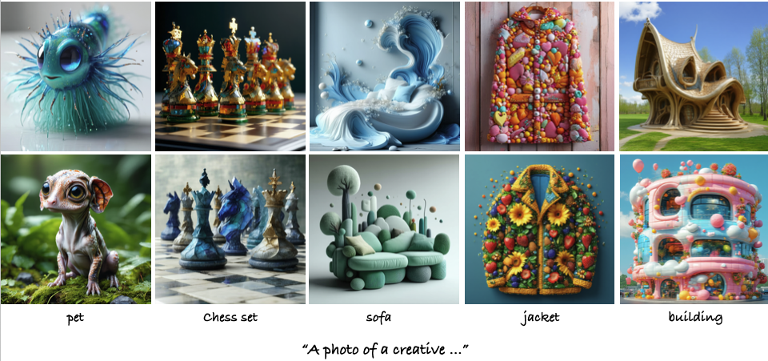

# VLM-Guided Adaptive Negative Prompting for Creative Generation

This repository contains the official implementation of **"VLM-Guided Adaptive Negative Prompting for Creative Generation"**.

📄 [Paper](https://arxiv.org/abs/2510.10715) | 🌐 [Project Page](https://shelley-golan.github.io/VLM-Guided-Creative-Generation/)



## Overview

Our method enhances creative generation in diffusion models through a closed-loop feedback mechanism that dynamically navigates the denoising process away from familiar visual patterns. During generation, a Vision-Language Model (VLM) monitors intermediate outputs to identify dominant elements, which are then accumulated as dynamic negative prompts to steer generation toward more creative outputs.

### Requirements

- Python 3.8+
- CUDA-compatible GPU (recommended: 24GB+ VRAM for SD3.5-Large)
- PyTorch 2.0+

### Setup

```bash
# Clone the repository
git clone https://github.com/shelley-golan/VLM-Guided-creative-diffusion.git
cd VLM-Guided-creative-diffusion

# Install dependencies
pip install torch torchvision --index-url https://download.pytorch.org/whl/cu118
pip install diffusers transformers accelerate safetensors pillow
pip install xformers  # Optional but recommended for memory efficiency

# For ViLT VQA model (lightweight, faster)
pip install transformers[vision]

# For Qwen-VL models (more capable, slower)
pip install qwen-vl-utils
```

## Usage

### Basic Generation (Standard SD3.5)

Generate images without VLM guidance (baseline):

```bash
python gen_utils/generate_sd35_image.py \
    --prompt "A photo of a creative object" \
    --output_dir ./outputs \
    --seed 42
```

### VLM-Guided Creative Generation

Generate images with adaptive negative prompting:

```bash
python gen_utils/generate_sd35_image.py \
    --prompt "A photo of a creative object" \
    --question "What is the main object in this image?" \
    --oracle_id "dandelin/vilt-b32-finetuned-vqa" \
    --vqa_stop_step 28 \
    --output_dir ./outputs \
    --seed 42
```

### Advanced Configuration

```bash
python gen_utils/generate_sd35_image.py \
    --prompt "A photo of a creative vehicle" \
    --question "What is the main object in this image?" "What type of vehicle is this?" \
    --oracle_id "dandelin/vilt-b32-finetuned-vqa" \
    --negative_prompt "blurry, low quality" \
    --steps 28 \
    --guidance_scale 4.5 \
    --topk 1 \
    --freq 1 \
    --vqa_start_step 0 \
    --vqa_stop_step 28 \
    --seed 42
```

### Debugging and Reproducibility

Track accumulated negative prompts during generation:

```bash
python gen_utils/generate_sd35_image.py \
    --prompt "A photo of a creative object" \
    --question "What is the main object in this image?" \
    --oracle_id "dandelin/vilt-b32-finetuned-vqa" \
    --log_negatives \
    --seed 42
```

This will print output like:
```
[Step 0] Added to negatives: 'sculpture'
[Step 0] Accumulated negatives: sculpture
[Step 1] Added to negatives: 'statue'
[Step 1] Accumulated negatives: sculpture, statue
...
```

### Visualizing Intermediate Predictions

Save intermediate x0 predictions to see how the image evolves during denoising:

```bash
python gen_utils/generate_sd35_image.py \
    --prompt "A photo of a creative pet" \
    --question "What type of pet is it?" \
    --oracle_id "dandelin/vilt-b32-finetuned-vqa" \
    --save_intermediate \
    --log_negatives \
    --seed 42
```

This saves intermediate predictions to `./generated_sd35/x0_preds/` with filenames like:
- `step_000_t_15.3333.png`
- `step_001_t_14.8214.png`
- `step_002_t_14.3095.png`
- etc.

These images show what the VLM analyzes at each denoising step.

### Parameters

#### Core Parameters
- `--prompt`: Positive prompt for image generation (required)
- `--output_dir`: Directory to save generated images (default: `./generated_sd35`)
- `--seed`: Random seed for reproducibility (default: 0)

#### SD3.5 Parameters
- `--steps`: Number of denoising steps (default: 28)
- `--guidance_scale`: CFG scale, *w* in paper (default: 4.5)
- `--height`: Image height in pixels (default: 1024)
- `--width`: Image width in pixels (default: 1024)

#### VLM-Guided Parameters
- `--question`: VLM question(s) for identifying features (can specify multiple)
- `--oracle_id`: HuggingFace VLM model ID (default: `dandelin/vilt-b32-finetuned-vqa`)
  - Supported: `dandelin/vilt-b32-finetuned-vqa` (fast, 13s overhead)
  - Supported: `Qwen/Qwen2.5-VL-3B-Instruct` (more capable)
  - Supported: `Qwen/Qwen2.5-VL-7B-Instruct` (most capable)
- `--vqa_start_step`: VQA start step index or fraction (default: 0). Use int for step index (e.g., 0) or float 0.0-1.0 for fraction of total steps
- `--vqa_stop_step`: VQA stop step index or fraction (default: 28). Use int for step index (e.g., 28) or float 0.0-1.0 for fraction of total steps
- `--topk`: Number of top VLM answers per question (default: 1)
- `--freq`: VLM query frequency in steps (default: 1)
- `--main_object`: Optional context to append to detected features
- `--clear_negatives_at_stop`: Clear accumulated negatives when VQA stops (default: keep them for creative steering)
- `--log_negatives`: Log accumulated negative prompts during generation for debugging and reproducibility
- `--save_intermediate`: Save intermediate x0 predictions during denoising for visualization
- `--intermediate_dir`: Directory name for intermediate predictions (default: `x0_preds`, created inside output_dir)

## Supported VLM Models

### ViLT (Recommended for Speed)
- **Model**: `dandelin/vilt-b32-finetuned-vqa`
- **Overhead**: ~13 seconds for 28 steps
- **VRAM**: Low additional memory usage
- **Best for**: Fast experimentation, batch generation

### Qwen-VL (Recommended for Quality)
- **Models**: 
  - `Qwen/Qwen2.5-VL-3B-Instruct` (lighter)
  - `Qwen/Qwen2.5-VL-7B-Instruct` (better)
- **Overhead**: Higher (varies by model size)
- **VRAM**: Higher additional memory usage
- **Best for**: High-quality creative generation

## Project Structure

```
VLM-Guided-creative-diffusion/
├── custom_model/
│   ├── __init__.py
│   └── custom_sd35.py           # CustomStableDiffusion3Pipeline with VLM guidance
├── gen_utils/
│   ├── __init__.py
│   └── generate_sd35_image.py   # Main generation script
├── README.md                     # This file
├── requirements.txt              # Python dependencies
├── LICENSE                       # Apache License 2.0
└── .gitignore                    # Git ignore patterns
```

## Runtime Performance

Our method adds minimal overhead compared to baseline SD3.5 generation:

- **Baseline SD3.5-Large**: ~22 seconds per image (28 steps)
- **Our method (ViLT + 28 steps VQA)**: ~35 seconds per image
- **Total overhead**: ~13 seconds

This is significantly faster than prior work:
- Concept-specific training methods: ~8 minutes per concept per seed
- Amplification factor search methods: ~30 minutes (10 samples per concept)

## Citation

If you use this code in your research, please cite our paper:

```bibtex
@misc{golan2025creative,
  author        = {Golan, Shelly and Nitzan, Yotam and Wu, Zongze and Patashnik, Or},
  title         = {VLM-Guided Adaptive Negative Prompting for Creative Generation},
  year          = {2025},
  eprint        = {2510.10715},
  archivePrefix = {arXiv},
  primaryClass  = {cs.GR},
}
```

## License

This project is licensed under the Apache License 2.0 - see the LICENSE file for details.

## Acknowledgments

- Built on [Stable Diffusion 3.5](https://huggingface.co/stabilityai/stable-diffusion-3.5-large) by Stability AI
- Uses [Diffusers](https://github.com/huggingface/diffusers) library by HuggingFace
- VLM support via [ViLT](https://github.com/dandelin/vilt) and [Qwen-VL](https://github.com/QwenLM/Qwen-VL)

## Contact

For questions or issues, please open an issue on GitHub.
